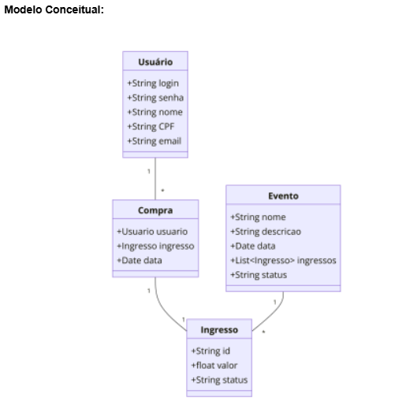

# Projeto: Sistema de Venda de Ingressos Online

## Apresentação do Problema

Uma empresa de entretenimento busca modernizar seu processo de venda de ingressos para eventos como shows, teatros e cinemas. O objetivo é desenvolver um sistema online que proporcione aos usuários uma experiência de compra intuitiva e eficiente.

O sistema proposto deverá ser capaz de gerenciar múltiplos eventos, exibir as opções de ingressos disponíveis e processar as compras de forma segura. A implementação abrangerá o cadastro de eventos, a gestão de ingressos e a realização de compras pelos usuários. Para facilitar o desenvolvimento e os testes da lógica de negócio, será utilizada uma fachada (Facade) enquanto a interface gráfica final não estiver pronta.

## Modelo Conceitual

A estrutura do sistema é baseada no seguinte modelo de classes:

* **Usuário**: Representa o cliente do sistema.
  * `+String login`
  * `+String senha`
  * `+String nome`
  * `+String CPF`
  * `+String email`
* **Evento**: Descreve os eventos disponíveis para compra.
  * `+String nome`
  * `+String descricao`
  * `+Date data`
  * `+List<Ingresso> ingressos`
  * `+String status`
* **Ingresso**: Representa um bilhete para um evento específico.
  * `+String id`
  * `+float valor`
  * `+String status`
* **Compra**: Modela a transação de um ingresso por um usuário.
  * `+Usuario usuario`
  * `+Ingresso ingresso`
  * `+Date data`

### Diagrama do Modelo Conceitual

## Funcionalidades (User Stories)

O desenvolvimento do sistema será guiado pelas seguintes histórias de usuário:

| User Story | Título                      | Breve Descrição                                                                               |
| :--------- | :-------------------------- | :-------------------------------------------------------------------------------------------- |
| 1          | Cadastrar usuário           | Usuário cadastra seus dados pessoais, login e senha.                                          |
| 2          | Fazer login de um usuário   | Usuário faz login no sistema de venda de ingressos.                                           |
| 3          | Cadastrar evento            | Administrador cadastra um novo evento com detalhes como nome, descrição e data.               |
| 4          | Listar eventos disponíveis  | Usuário lista os eventos disponíveis no sistema.                                              |
| 5          | Comprar ingresso            | Usuário compra um ingresso disponível para um evento, se o mesmo estiver ativo.               |
| 6          | Listar ingressos comprados  | Usuário lista todos os ingressos que ele comprou.                                             |
| 7          | Cancelar compra de ingresso | Usuário pode cancelar a compra de um ingresso, se o evento ainda não tiver ocorrido.          |